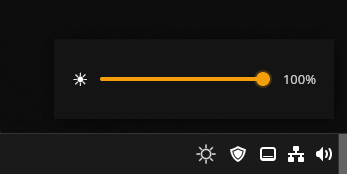

# Sun ☀️

A lightweight system tray app for controlling external monitor brightness on Linux via DDC/CI.



## What it does

Sun sits in your system tray and lets you adjust your external monitor's brightness with a slider. No settings buried in menus, no terminal commands. Click the icon, drag the slider, done.

It communicates with your monitor using `ddcutil` over the DDC/CI protocol. Each command takes 1 to 3 seconds depending on the monitor. That is a hardware limitation, not a bug.

## Requirements

- A Linux desktop with AppIndicator support (Cinnamon, KDE, XFCE, GNOME with extension)
- An external monitor that supports DDC/CI (most modern monitors do)
- [`ddcutil`](https://www.ddcutil.com/) installed

## Getting started

**1. Download** the package for your distro from the [Releases](https://github.com/HarukaYamamoto0/sun/releases) page.

**2. Install it:**

```bash
# Debian, Ubuntu, Linux Mint
sudo dpkg -i Sun_*.deb

# Fedora, openSUSE
sudo dnf install Sun_*.rpm
```

The installer handles everything. It installs `ddcutil` if missing and configures i2c access for your user automatically.

**3. Log out and back in** so the i2c permissions take effect.

**4. Launch Sun** from your application menu or run `sun` in a terminal.

> **AppImage users:** AppImage has no installer, so you will need to configure ddcutil and i2c access manually. See [docs/appimage-setup.md](docs/appimage-setup.md) for instructions.

## Settings

Click the tray icon, then open Settings from the menu. Available options:

- **Launch at login** — start Sun automatically on boot
- **Brightness step** — how much the slider moves per tick (1%, 5%, 10%, 25%)
- **Resync brightness** — periodically reapplies brightness to prevent monitors that reset on their own
- **Resync interval** — how often to reapply (1s, 2s, 5s, 10s)

Settings are saved to `~/.config/sun/config.toml`.

## Building from source

```bash
# Prerequisites: Rust, Bun, and Tauri system dependencies
# See: https://v2.tauri.app/start/prerequisites/#linux

git clone https://github.com/HarukaYamamoto0/sun
cd sun
bun install
bun run tauri build
```

For development with hot reload:

```bash
bun run tauri dev
```

## Contributing

Issues and pull requests are welcome. If your monitor is not working, run `ddcutil detect` and `ddcutil getvcp 10` first. If those fail, the issue is with ddcutil or your monitor's DDC/CI support, not Sun.

## License

[MIT](./LICENSE)